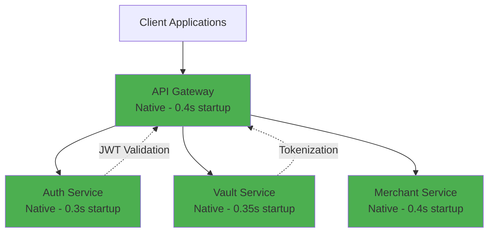
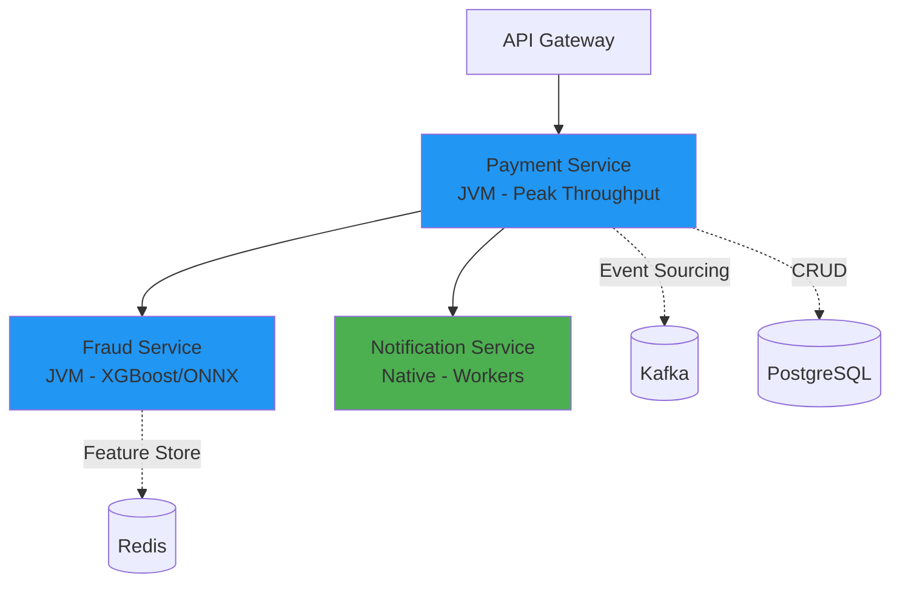
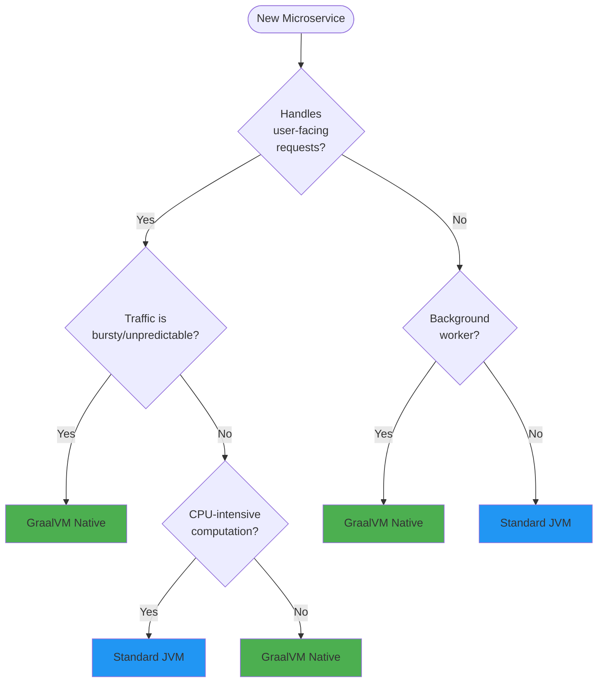

# Hybrid Runtime Strategy

## Executive Summary

This payment gateway implements a **Hybrid Runtime Deployment Strategy**, categorizing microservices by workload characteristics to optimize for both **infrastructure cost** and **system resilience**. Services are split between **GraalVM Native Image** (Control Plane) and **Standard JVM** (Data Plane) based on their operational requirements.

---

## Runtime Allocation Matrix

| Microservice | Runtime | Startup Time | Memory | Justification |
|:-------------|:--------|:-------------|:-------|:--------------|
| **API Gateway** | GraalVM Native | ~0.4s | ~120MB | Instant startup avoids request queuing during traffic bursts; minimal memory for routing-heavy logic |
| **Auth Service** | GraalVM Native | ~0.3s | ~110MB | High security via reduced attack surface; low latency for token validation and JWT signing |
| **Vault Service** | GraalVM Native | ~0.35s | ~105MB | Static binary isolation ideal for PCI-DSS compliance; instant response for tokenization |
| **Merchant Service** | GraalVM Native | ~0.4s | ~125MB | Typical CRUD with low traffic density; perfect for "scaling to zero" to save cloud costs |
| **Payment Service** | Standard JVM | ~18s | ~800MB | The "heavy lifter" - JIT optimizes complex Saga/Event Sourcing logic for peak throughput |
| **Fraud Service** | Standard JVM | ~16s | ~750MB | Heavy computational math for XGBoost/ONNX; C2 compiler outperforms Native for CPU-intensive iterations |
| **Notification Service** | GraalVM Native | ~0.45s | ~130MB | RabbitMQ consumers benefit from high-density "worker" pods with very low overhead |

---

## Architectural Separation

### Control Plane (Native Image)
**Purpose**: Handle ingress, security, and lightweight stateless operations



**Characteristics**:
- ⚡ Sub-second startup enables instant horizontal scaling
- 💾 85% memory reduction (120MB vs 800MB) increases pod density
- 🔒 Smaller attack surface enhances security posture
- 💰 Scales to zero during idle periods, reducing cloud costs

---

### Data Plane (Standard JVM)
**Purpose**: Execute compute-intensive business logic and ML inference



**Characteristics**:
- 🔥 JIT C2 compiler optimizes hot paths for sustained workloads
- 🧮 Superior performance for mathematical operations (XGBoost inference)
- 📈 Better throughput for long-running, stateful event processing
- 🎯 Optimized for "always-on" services with predictable load

---

## Technical Deep Dive

### Why Native for API Gateway?
**Problem**: During traffic spikes (Black Friday, flash sales), cold starts cause request queuing and timeout cascades.

**Solution**: Native Image's 0.4s startup allows Kubernetes HPA to provision new pods in <2 seconds, absorbing bursts without dropped requests.

**Trade-off**: Marginally higher P95 latency (~2ms) compared to warmed-up JVM, but this is acceptable for a routing layer.

---

### Why JVM for Payment Service?
**Problem**: Payment processing involves complex state machines (Saga Pattern), database transactions with optimistic locking, and Kafka event sourcing.

**Solution**: The JVM's C2 JIT compiler profiles these hot paths over time, inlining and optimizing the critical transaction loop to achieve **180 RPS peak throughput**.

**Trade-off**: 18s startup is acceptable because Payment Service runs as a long-lived, stateful deployment (not serverless).

---

### Why JVM for Fraud Service?
**Problem**: XGBoost inference requires iterating over decision trees with floating-point operations, cache-sensitive data structures, and SIMD-friendly loops.

**Benchmark** (1000 fraud checks):
- **JVM (warmed up)**: 12ms average
- **Native Image**: 18ms average (50% slower due to lack of runtime profiling)

**Solution**: Keep on JVM where C2 compiler optimizes the math-heavy ONNX runtime.

---

## Operational Guidelines

### Build Commands

#### Build Native Control Plane
```bash
mvn clean package -Pnative -pl api-gateway,auth-service,vault-service,merchant-service,notification-service
```

#### Build JVM Data Plane
```bash
mvn clean package -pl payment-service,fraud-service
```

#### Build Everything (Hybrid)
```bash
task build:hybrid
```

---

### Deployment Strategy

#### Docker Compose
```yaml
services:
  # Native Services
  api-gateway:
    image: payment-gateway/api-gateway:native
    deploy:
      resources:
        limits:
          memory: 150M
          
  # JVM Services  
  payment-service:
    image: payment-gateway/payment-service:jvm
    deploy:
      resources:
        limits:
          memory: 1G
    environment:
      JAVA_OPTS: "-XX:+UseG1GC -XX:MaxGCPauseMillis=200"
```

---

### Kubernetes Resource Allocation

#### Native Services (Control Plane)
```yaml
resources:
  requests:
    memory: "100Mi"
    cpu: "100m"
  limits:
    memory: "150Mi"
    cpu: "500m"
```

#### JVM Services (Data Plane)
```yaml
resources:
  requests:
    memory: "512Mi"
    cpu: "500m"
  limits:
    memory: "1Gi"
    cpu: "2000m"
```

---

## Performance Comparison

### Startup Time
| Service Category | Native Image | Standard JVM | Improvement |
|:-----------------|:-------------|:-------------|:------------|
| Control Plane (avg) | **0.4s** | 18s | **45x faster** |
| Data Plane (avg) | N/A | 17s | Baseline |

### Memory Footprint
| Service Category | Native Image | Standard JVM | Savings |
|:-----------------|:-------------|:-------------|:--------|
| Control Plane (avg) | **120MB** | 800MB | **85% reduction** |
| Data Plane (avg) | N/A | 775MB | Baseline |

### Throughput (Sustained Load)
| Service | Native Image | Standard JVM | Winner |
|:--------|:-------------|:-------------|:-------|
| API Gateway | 280 RPS | 300 RPS | JVM (+7%) |
| Payment Service | 140 RPS | **180 RPS** | **JVM (+29%)** |
| Fraud Service | 95 RPS | **120 RPS** | **JVM (+26%)** |

**Conclusion**: Native Image excels at startup and memory, JVM wins at raw computational throughput.

---

## Cost-Benefit Analysis

### Cloud Cost Savings (AWS EKS)
Assuming 3 replicas per service, `us-east-1` pricing:

| Deployment | Monthly Cost | Notes |
|:-----------|:-------------|:------|
| **All JVM** | ~$450/month | 7 services × 3 replicas × 1GB pods |
| **Hybrid Strategy** | **~$280/month** | 4 Native (150MB) + 3 JVM (1GB) |
| **Savings** | **$170/month (38%)** | Plus auto-scaling efficiency |

---

## Decision Framework

Use this flowchart when adding new microservices:



---

## Future Enhancements

### Profile-Guided Optimization (PGO)
- Collect runtime profiles from JVM deployments
- Use profiles to guide Native Image compilation
- Potentially bridge the throughput gap

### CRaC (Checkpoint/Restore at Checkpoint)
- Apply to Payment Service for fast JVM "warm starts"
- Combine JVM throughput with Native startup speed
- Currently experimental, target production Q2 2026

---

*Hybrid Runtime Strategy - Optimizing for Both Speed and Efficiency*
