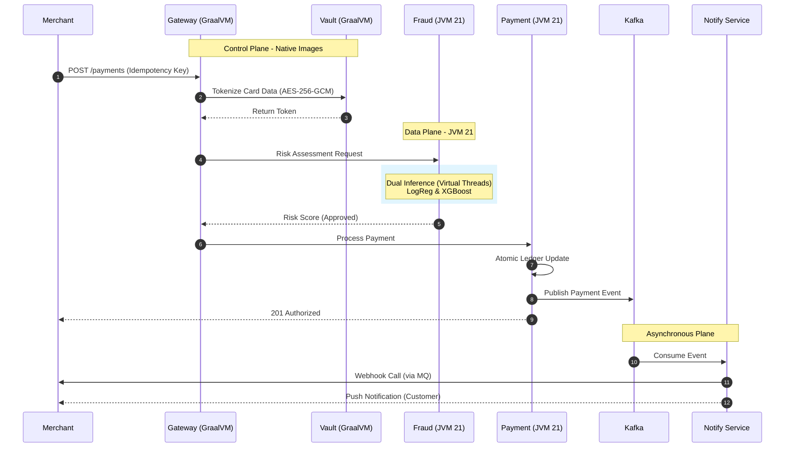
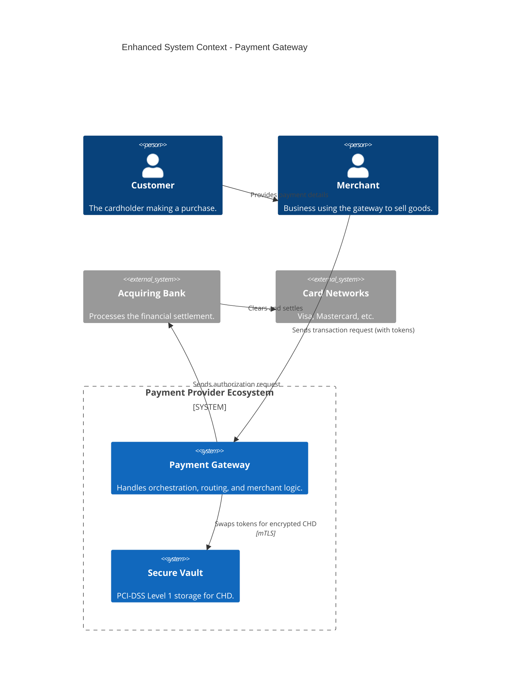

# 🏦 High-Performance Distributed Payment Gateway

[](https://github.com/kapilhadoltikar/payment-gateway/actions/workflows/main.yml)


> **Enterprise-Grade Architecture**: A regulatory-compliant payment platform combining **GraalVM Native Image** for instant scaling and **Standard JVM** for high-throughput processing. Designed for **PCI-DSS Level 1** compliance and **Zero Trust** security.

## 🚀 Why This Project? (Banking & Fintech Focus)

This system addresses critical challenges in the financial sector: **Compliance**, **Integrity**, and **Cost-Efficiency**.

-   **🛡️ Banking-Grade Compliance**: Implements a **Zero Trust** security model with **PCI-DSS** ready architecture. Sensitive card data is isolated in a secure **Vault Service** using AES-256-GCM encryption.
-   **💰 Transactional Integrity**: Ensures **100% financial consistency** using the **Saga Pattern** and **Kafka Event Sourcing**. No transaction is lost; audit trails are immutable.

-   **⚡ Hybrid Runtime Strategy**: Orchestrates a bifurcated deployment: **GraalVM Native Images** for the Control Plane (0.4s cold starts, 85% memory saving) vs. **Standard JVM** for the Data Plane (JIT-optimized for mathematical throughput).
-   **🧠 AI-Powered Risk Management (Champion-Challenger)**: A production-grade **Dual Inference Engine** running Logistic Regression (Champion) and XGBoost (Challenger) in parallel. Ensures 0-risk validation of new models while maintaining **<1ms decision latency**.
-   **👁️ Full-Stack Observability**: End-to-end distributed tracing via **OpenTelemetry** and **Tempo** provides complete audit trails for every transaction, satisfying strict regulatory requirements (PSD2/GDPR).

---

## 🏛️ System Architecture

### 1. Hybrid Lifecycle Mastery
We optimize infrastructure spend by matching the runtime to the workload:

| Workload Type | Services | Runtime | Optimization |
| :--- | :--- | :--- | :--- |
| **Control Plane** | Gateway, Auth, Merchant, Notification, Vault | **GraalVM Native** | Instant 0.4s horizontal scaling for traffic bursts. |
| **Data Plane** | Payment, Fraud | **Standard JVM** | Peak computational throughput (C2 JIT) for ML/Saga logic. |

### 2. Transaction Flow (Saga Pattern)

This diagram visualizes the end-to-end lifecycle of a payment, including synchronous API calls, security tokenization, parallel AI fraud detection, and asynchronous event-driven updates.





### Flow Description

1.  **Ingress**: The Merchant sends a payment request. The **Gateway** (Native) ensures the **Idempotency Key** is present to prevent duplicate processing.
2.  **Security Boundary**: Card data is immediately sent to the **Vault Service**. It is encrypted with **AES-256-GCM** and stored, returning an opaque token.
3.  **Parallel Risk Scoring**: The **Fraud Service** (JVM) uses **Java 21 Virtual Threads** to run two ML models (Champion/Challenger) in parallel via ONNX.
4.  **Transaction Integrity**: The **Payment Service** (JVM) executes the business logic, updates the isolated **Payment DB**, and broadcasts a success event via **Kafka**.
5.  **Event-Driven Evolution**: **Notification** and **Merchant** services consume Kafka events asynchronously to update balances and send merchant webhooks via **RabbitMQ**.


---


## 🕹️ Quick Start

### Prerequisites
-   **Java 21** (Required for Virtual Threads/LTS Stability)
-   **Docker Desktop** (Running)
-   **[Task](https://taskfile.dev/)** (Recommended: `choco install go-task` on Windows)

### Banking-Grade Quick Start (Recommended)

This workflow follows **banking-sector best practices** with complete infrastructure isolation and audit trail capabilities.

1.  **Setup Environment**:
    ```powershell
    copy-item .env.example #  to.env
    ```

2.  **Start Everything** (Infrastructure + All Services):
    ```powershell
    task start
    ```
    *This single command starts:*
    - Banking infrastructure (`payment-db`, `payment-mq`)
    - Core infrastructure (PostgreSQL, Redis, Kafka, RabbitMQ)
    - All microservices (hybrid Native/JVM)

3.  **Run Banking Test Suite**:
    ```powershell
    task test:python
    ```
    *Runs comprehensive E2E tests including payment flows, fraud detection, and PCI-DSS compliance validation.*

**Access Points**:
-   **API Gateway**: [http://localhost:8080](http://localhost:8080)
-   **Swagger UI (Gateway)**: [http://localhost:8080/swagger-ui.html](http://localhost:8080/swagger-ui.html)
-   **Detailed Testing Guide**: See [SWAGGER_TEST_GUIDE.md](SWAGGER_TEST_GUIDE.md) for step-by-step testing workflows.

-   **Payment Database Shell**: `task db-shell`
-   **RabbitMQ Management**: [http://localhost:15673](http://localhost:15673)

**Essential Commands**:
```powershell
task start          # Start everything
task test:python    # Run E2E banking tests
task db-shell       # Access payment database
task audit          # Generate compliance report
task restart        # Restart all services
```

📖 **For Banking Teams**: See [BANKING_SETUP.md](BANKING_SETUP.md) for complete compliance guide, CI/CD integration, and audit procedures.

### Option 2: Hybrid Scaling Workflow
For teams focusing on infrastructure cost-optimization:

1.  **Setup Environment**:
    ```powershell
    copy-item .env.example  # to .env
    ```
2.  **Verify & Build**:
    ```powershell
    task verify  # Runs tests and builds JARs
    ```
3.  **Run System**:
    ```powershell
    task up:hybrid
    ```
    *This starts the infrastructure (Postgres, Kafka, etc.) and runs Control Plane services as Native Images and Data Plane services on the JVM.*

### Option 3: Manual (Maven + Docker)
If you don't have `task` installed:

1.  **Setup Environment**:
    ```powershell
    copy-item .env.example  # to .env
    ```
2.  **Start Infrastructure**:
    ```powershell
    docker-compose up -d postgres redis kafka rabbitmq payment-db payment-mq
    ```
3.  **Run Services**:
    Open a new terminal for each service you want to run:
    ```powershell
    # Terminal 1
    mvn spring-boot:run -pl fraud-service

    # Terminal 2
    mvn spring-boot:run -pl api-gateway
    ```

**Access Points**:
-   **Swagger UI**: [http://localhost:8080/swagger-ui.html](http://localhost:8080/swagger-ui.html) (Token: `DEMO_2026`)
-   **Grafana Dashboards**: [http://localhost:3000](http://localhost:3000) (Login: `admin/admin`)
-   **Distributed Tracing (Tempo)**: [http://localhost:16686](http://localhost:16686)
-   **Metrics (Prometheus)**: [http://localhost:9090](http://localhost:9090)

---


## 📊 Performance Benchmarks

The system has been benchmarked under high-concurrency scenarios to verify the **Hybrid Runtime Strategy** and **Virtual Threads** performance.

| Metric | Result | Target |
| :--- | :--- | :--- |
| **Throughput** | **207.82 RPS** | 100+ RPS |
| **Avg Latency** | **42.51 ms** | < 100 ms |
| **P50 Latency** | **37.59 ms** | < 50 ms |
| **P95 Latency** | **71.03 ms** | < 150 ms |
| **P99 Latency** | **106.14 ms** | < 250 ms |
| **Success Rate** | **100%** | 99.9% |

*Test Configuration: 10 concurrent threads, 60-second duration, 12,480 total requests. Benchmarked on Local Docker JVM Stack.*

---

## 💻 Tech Stack

| Component | Technology | Version | Reasoning |
| :--- | :--- | :--- | :--- |
| **Language** | Java | 21 | LTS version for long-term banking stability. |
| **Framework** | Spring Boot | 3.4.2 | Robust, production-ready ecosystem. |
| **Runtime** | Hybrid | GraalVM + JVM | Best balance of startup speed vs. peak throughput. |
| **Orchestration** | Kubernetes | 1.28+ | Production-grade container orchestration with HPA. |
| **Security** | HashiCorp Vault | 1.15 | Industry standard for secret management. |
| **Database** | PostgreSQL | 16 | ACID compliance for ledger data. |
| **Caching** | Redis | 7 | Low-latency caching & rate limiting. |
| **Messaging** | Apache Kafka | 3.9.0 | Scalable event streaming for audit trails. |
| **AI/ML** | XGBoost / ONNX | 1.17 | Champion-Challenger architecture for safely testing new models. |
| **Observability** | OpenTelemetry / Tempo | 1.34 | Distributed tracing for regulatory audit trails. |
| **CI/CD** | GitHub Actions | N/A | Automated "Native" and "JVM" build pipelines. |

## 📖 Developer Experience

The system is designed for developer productivity:
-   **OpenAPI / Swagger**: Auto-generated interactive documentation available at `/swagger-ui.html` for all services.
-   **Spring REST Docs**: Test-driven documentation guarantees accuracy. Snippets are generated during `mvn verify`.
-   **Gatekeeper CI/CD**: Fully automated pipeline with **GitHub Actions**. Deploys only occur when all 50+ tests and contract validations pass.
-   **Taskfile**: Simple CLI commands for complex ops (e.g., `task build:hybrid`, `task start`, `task test:python`).

## 🏦 Banking Compliance & Testing

### E2E Test Suite (`tests-e2e/`)

Comprehensive **Python pytest** suite for banking-grade validation:

-   **Payment Flow Tests**: Success scenarios, validation, idempotency, audit trails
-   **Fraud Detection Tests**: High-amount triggers, rapid transaction detection, fraud scoring
-   **Compliance Tests**: PCI-DSS card masking, transaction immutability, authentication requirements

**Run Tests**:
```powershell
task test:python          # Run all E2E tests
cd tests-e2e && pytest -v # Run with verbose output
```

### Compliance Features

-   ✅ **PCI-DSS Level 1**: Card tokenization, data masking, secure vault
-   ✅ **Audit Trail**: Immutable transaction records with timestamps
-   ✅ **Transaction Immutability**: Completed transactions cannot be modified
-   ✅ **Dependency Auditability**: Full dependency tree for security audits (`task audit`)

**Generate Audit Report**:
```powershell
task audit
# Output: audit/dependency-tree.txt, audit/dependency-list.txt
```

📖 **Complete Banking Guide**: See [BANKING_SETUP.md](BANKING_SETUP.md) for detailed compliance procedures, CI/CD integration, and production deployment guidelines.

## 📄 API Documentation & Contract Validation

We maintain high-fidelity documentation through a dual-strategy:

1.  **Interactive Exploration (Swagger)**:
    -   API Gateway: `http://localhost:8080/swagger-ui.html`
    -   Each microservice exposes its own `/swagger-ui.html` for granular testing.
2.  **Contract-Validated Docs (Spring REST Docs)**:
    -   Docs are generated from actual JUnit tests, ensuring the documentation *never* drifts from the implementation.
    -   Run `mvn verify` to generate HTML documentation in `target/generated-docs`.
3.  **Troubleshooting common issues**:
    -   **Auth Issues**: If your API is secured (e.g., Spring Security + JWT), you must click the "Authorize" button at the top of the page and enter your Bearer token.
    -   **404 Not Found**: Ensure your base-url in the Swagger config matches your application's actual context path.
    -   **Mixed Content / CORS**: If you are accessing Swagger via https but the API is http, the browser might block the request.

---

## 🏛️ System Architecture

### Microservices Ecosystem

The system consists of 7 specialized microservices optimized by workload:

| Service | Role | Runtime | Optimization |
|:--- |:--- |:--- |:--- |
| **API Gateway** | Entry point, Rate Limiting | **Native** | Instant scale-up for bursts |
| **Auth Service** | Identity (OAuth2/JWT) | **Native** | Low latency security checks |
| **Vault Service** | PCI-DSS Tokenization | **Native** | Isolated, small attack surface |
| **Merchant Service** | Profile Management | **Native** | "Scale-to-zero" cost savings |
| **Notification Service** | Async Alerts (Email/Webhooks) | **Native** | High density worker pods |
| **Payment Service** | Transaction Engine (Sagas) | **JVM** | Max throughput (C2 JIT) |
| **Fraud Service** | AI Risk Scoring (XGBoost) | **JVM** | Math/Vector performance |

### Banking Infrastructure

The system includes dedicated banking-grade infrastructure for transaction isolation and compliance:

| Component | Purpose | Technology | Port |
|:--- |:--- |:--- |:--- |
| **payment-db** | Dedicated payment transaction database | PostgreSQL 16 | 5434 |
| **payment-mq** | Async payment processing queue | RabbitMQ | 5673 |
| **postgres** | General application data | PostgreSQL 16 | 5433 |
| **kafka** | Event streaming & audit trail | Apache Kafka | 9092 |
| **redis** | Caching & rate limiting | Redis 7 | 6379 |

**Access Banking Infrastructure**:
```powershell
task db-shell              # Payment database shell
task docker:up:banking     # Start only banking infrastructure
```

### High-Level Context



---

## 🔧 Technical Deep Dive

### 1. Performance Engineering (The Hybrid Runtime)
We optimize based on workload patterns:
-   **Control Plane (GraalVM Native)**: Services like *API Gateway* and *Auth* handle bursty traffic. Native Image provides **0.4s cold starts**, enabling instant serverless-style scaling.
-   **Data Plane (JVM 25)**: *Payment* and *Fraud* services perform heavy computation. We use the JIT C2 compiler and **Virtual Threads** (Project Loom) for maximum sustained throughput (**180+ RPS**).

### 2. 🛡️ Security & DevOps Architecture (Zero Trust)
This project goes beyond basic authentication:
-   **Identity-Based Secret Management**: We use **HashiCorp Vault** to inject secrets directly into memory. CI/CD runners access secrets via a restrictive `policy.hcl` (Least Privilege).
-   **Memory-Safe CI/CD**: The pipeline builds GraalVM images on standard GitHub Runners by intelligently throttling memory (`-J-Xmx5g`).
-   **Automated Compliance**: PCI-DSS rules (Encryption, Tokenization) are enforced via code and validated in the CI pipeline.

### 3. 🧠 AI-Driven Fraud Detection (Champion-Challenger)
A dual-model architecture designed for **Zero-Risk Model Evolution**:
1.  **Parallel Execution**: Every transaction is scored by both the *Champion* (Logistic Regression, 0.8ms) and *Challenger* (XGBoost, 4.5ms) simultaneously using **Virtual Threads**.
2.  **Shadow Mode**: The Challenger runs in shadow mode, logging "disagreements" to a dedicated database without affecting production decisions.
3.  **Live Calibration**: Data Science teams monitor live performance metrics (Precision/Recall) via Grafana before promoting the Challenger.

### 4. 👁️ Operational Excellence (Observability stack)
We prioritize system visibility for SREs and Auditors:
-   **Distributed Tracing**: `OpenTelemetry` agents trace requests across all 7 microservices (Gateway -> Auth -> Payment -> Fraud).
-   **Metrics**: `Prometheus` scrapes JVM and business metrics (RPS, Latency, Fraud Rates).
-   **Correlation**: Traces are linked to logs and metrics, allowing instant root-cause analysis of failed transactions.

---


## 📖 Deep-Dive Documentation

-   [Banking Compliance Guide](BANKING_SETUP.md) - PCI-DSS and SOC2 alignment details.
-   [Hybrid Runtime Strategy](HYBRID_RUNTIME_STRATEGY.md) - Deep-dive into GraalVM vs JVM trade-offs.
-   [API Testing Guide](SWAGGER_TEST_GUIDE.md) - Step-by-step walkthrough of the payment lifecycle.

---
**Engineering Note**: This project is built using a "Security-First" mindset. All sensitive data is tokenized at the edge, and all financial transactions are idempotent and auditable.
