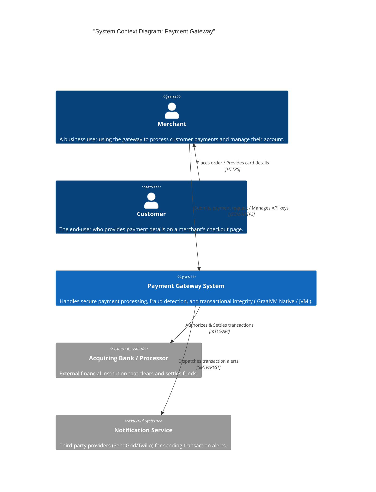

# System Context Diagram

This diagram provides a high-level overview of how the **Payment Gateway** interacts with users and external third-party systems.

## Key Interactions

1.  **Merchant to Gateway**: Merchants integrate via the **API Gateway** to process transactions.
2.  **Gateway to Bank**: The **Payment Service** communicates with external acquiring banks to authorize funds.
3.  **Security Boundary**: All card data is tokenized internally before being stored or transmitted.
4.  **Async Notifications**: The **Notification Service** handles delivery of receipts and webhooks to external providers.
